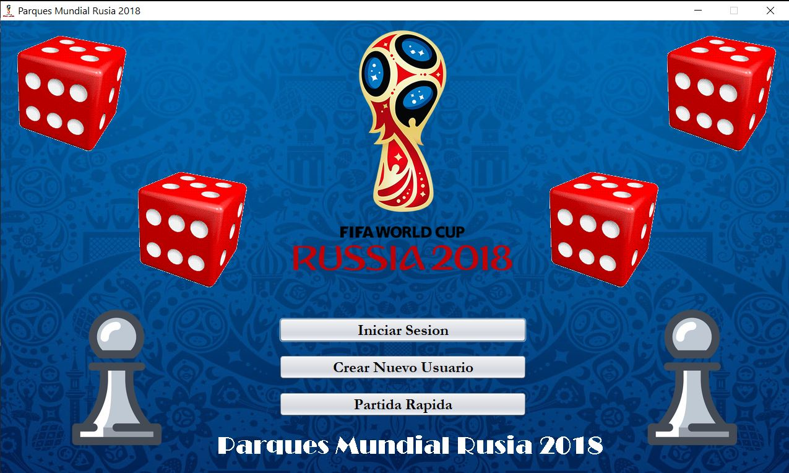
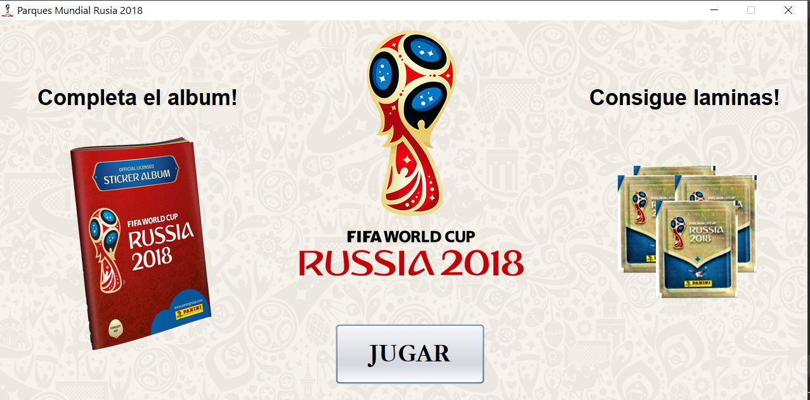
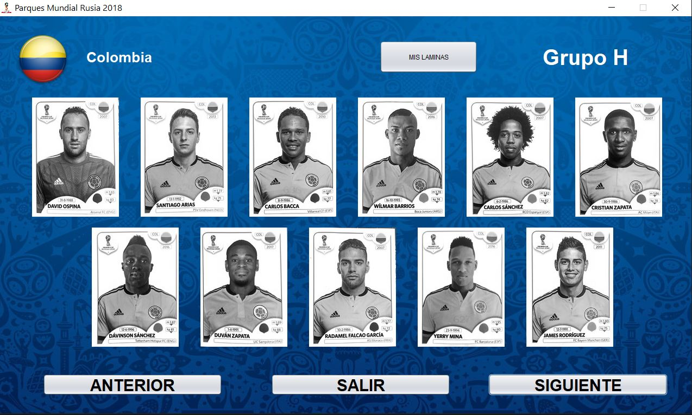
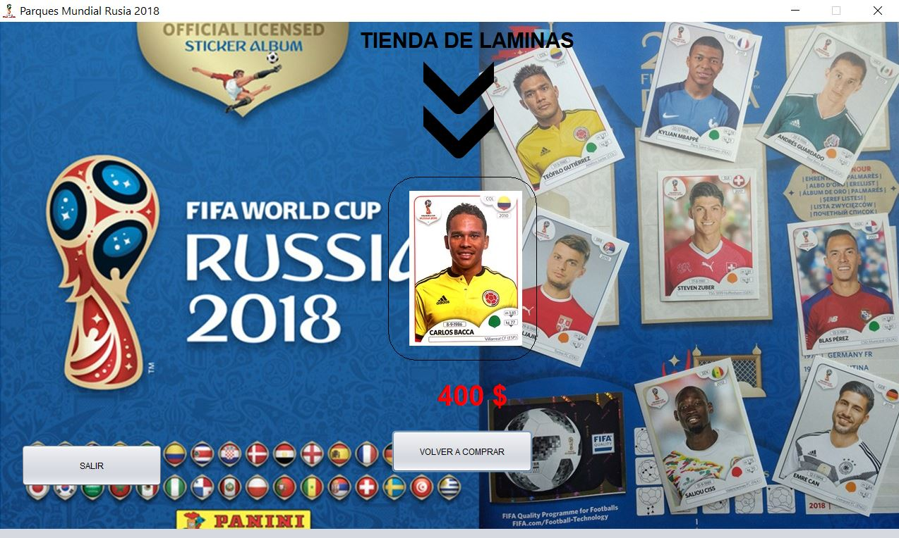
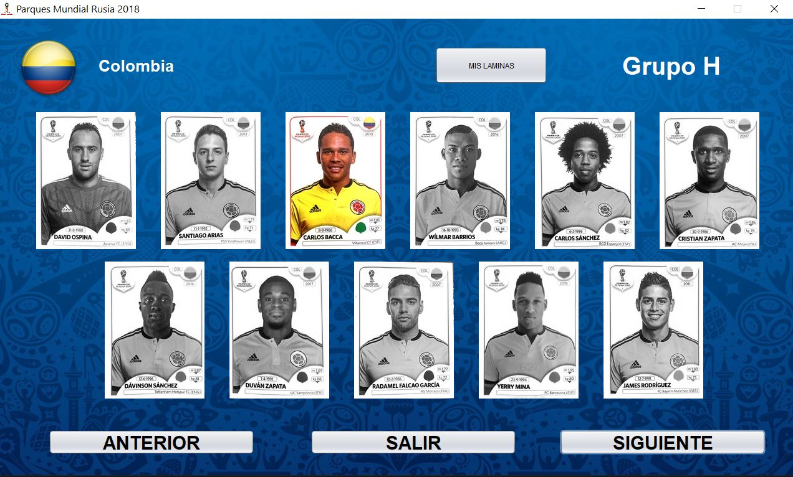
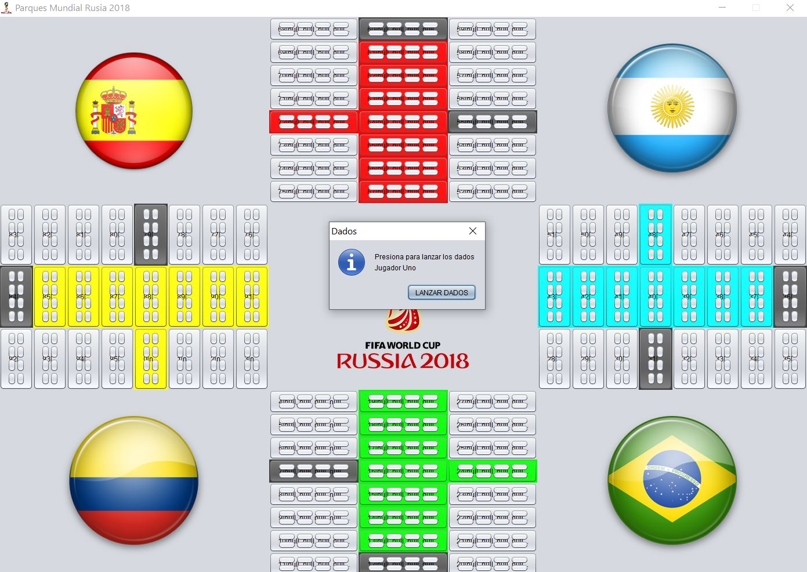

# Parcheesi Game - World Cup 2018 (Panini Album)

This project is a desktop application, mainly divided into two parts. On the one hand, there is the Panini album corresponding to the 2018 World Cup, where you can find each of the teams attending this great event with their main players.

In this part, the main objective is to fill the panini album with their respective sheets, for that you must acquire money by winning in the Parcheesi game. When you get a sheet, it is automatically "pasted" in the album, as shown below:

This Album was implemented as a Doubly Circular Linked List

On the other hand, this project has the traditional parcheesi game for four players.

